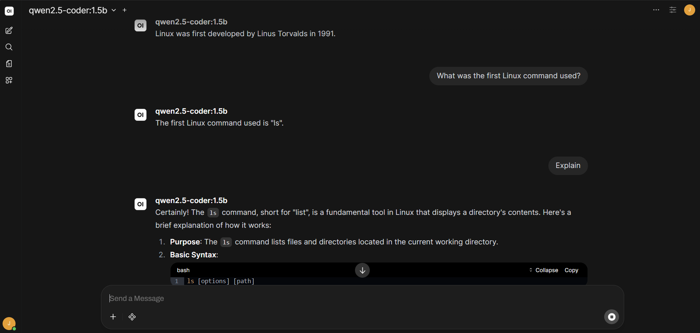
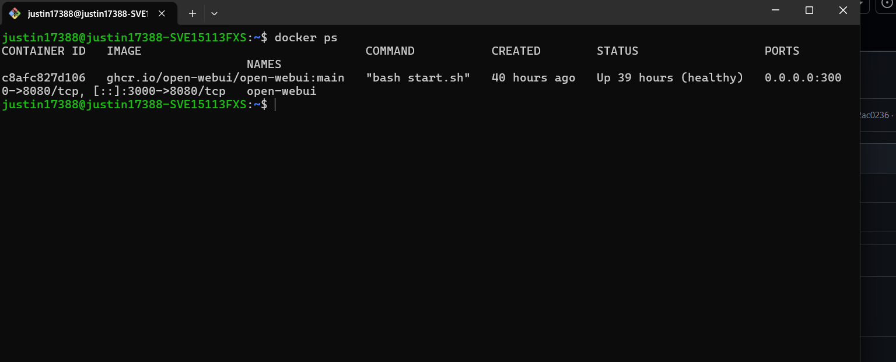
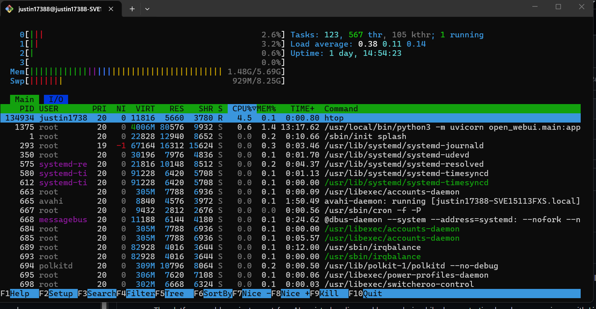
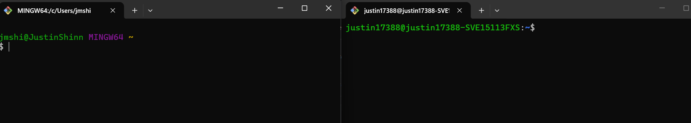

# 🧠 Self-Hosted AI DevOps Assistant Homelab

## Overview

This project transforms a legacy Sony Vaio laptop into a self-hosted AI-powered DevOps homelab server. The system runs a locally hosted large language model (LLM) using Ollama, paired with a Dockerized Open WebUI frontend for browser-based interaction.

The platform enables private, cost-free AI-assisted coding and log analysis while demonstrating hands-on experience with Linux system administration, containerization, networking, and service configuration. Remote access is securely provided through Tailscale, allowing the system to function as a lightweight, always-on infrastructure node accessible from anywhere.

---

## 🔧 Tech Stack

### 🖥️ Infrastructure & OS
- Linux Mint XFCE (lightweight desktop environment)
- Sony Vaio E Series (repurposed legacy hardware)

### 🐳 Containerization & Services
- Docker
- Open WebUI (containerized frontend)

### 🧠 AI / Machine Learning
- Ollama (local LLM runtime)
- qwen2.5-coder / tinyllama (local models)

### 🌐 Networking & Remote Access
- Tailscale (secure remote access VPN)
- Local LAN networking
- SSH (OpenSSH server)

### ⚙️ System Optimization
- Swap (virtual memory expansion)
- zRAM (compressed memory)

### 🛠️ System Management
- systemd (service management)
- Bash / Linux CLI

---

## 🏗️ Architecture
Client Browser (LAN)
↓
Open WebUI (Docker Container)
↓
Ollama (Local Service)
↓
LLM Model (qwen2.5-coder / tinyllama)

---

## 🚀 Features

- Self-hosted AI assistant (no external API required)
- Browser-based interface accessible across local network
- Coding and log analysis capabilities
- Persistent services with auto-restart
- Optimized for low-memory hardware
- Headless operation (lid closed, remote access)
- Secure remote access via Tailscale
- Browser-based AI interface accessible from anywhere
  
---

## 🧪 Key Learning Areas

- Linux system installation and configuration
- Troubleshooting BIOS/bootloader issues
- Memory optimization using swap and zRAM
- Docker container deployment and management
- Debugging container-to-host networking
- Service management with systemd
- Local AI model hosting and inference

---

## ⚙️ Challenges & Solutions

### ❌ Open WebUI could not connect to Ollama
- **Cause:** Ollama bound to localhost only
- **Fix:** Configured systemd override to bind to `0.0.0.0`

### ❌ Docker container unable to resolve host
- **Cause:** Missing host mapping
- **Fix:** Added `--add-host=host.docker.internal:host-gateway`

### ❌ Model not appearing in WebUI
- **Cause:** API connection failure / UI cache
- **Fix:** Restarted services and forced connection refresh

---

## 📸 Screenshots

### Web Interface

### Docker Containers

### System Monitoring

### Ollama Models

### Remote SSH Access

---

## 📈 Future Improvements

- Reverse proxy with Nginx
- HTTPS with Let's Encrypt
- Authentication hardening
- Remote access via VPN or tunneling
- Automated log ingestion and analysis
- Monitoring stack (Prometheus + Grafana)

---

## 💡 Summary

This project demonstrates the ability to design, deploy, and troubleshoot a full-stack, self-hosted system using real-world DevOps practices. It highlights hands-on experience with infrastructure, containers, networking, and AI integration on constrained hardware.
